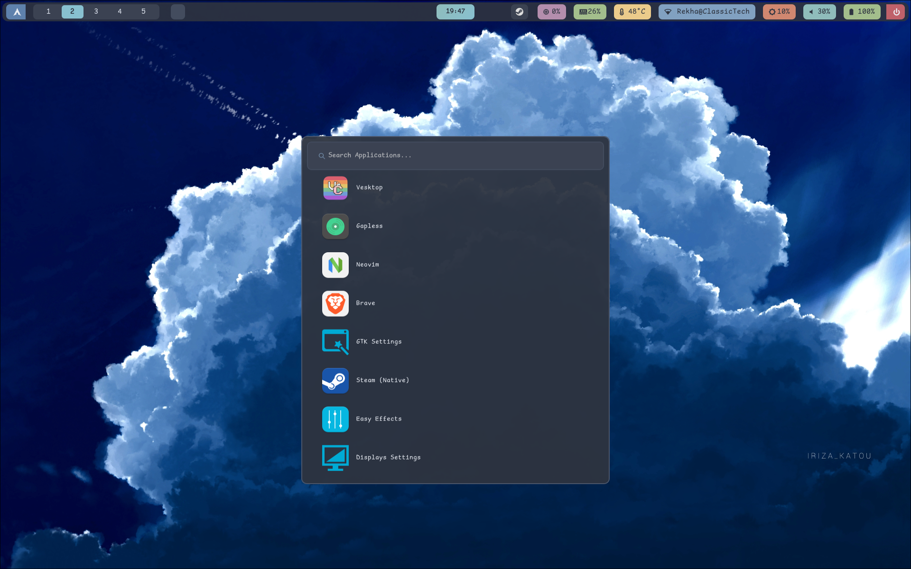
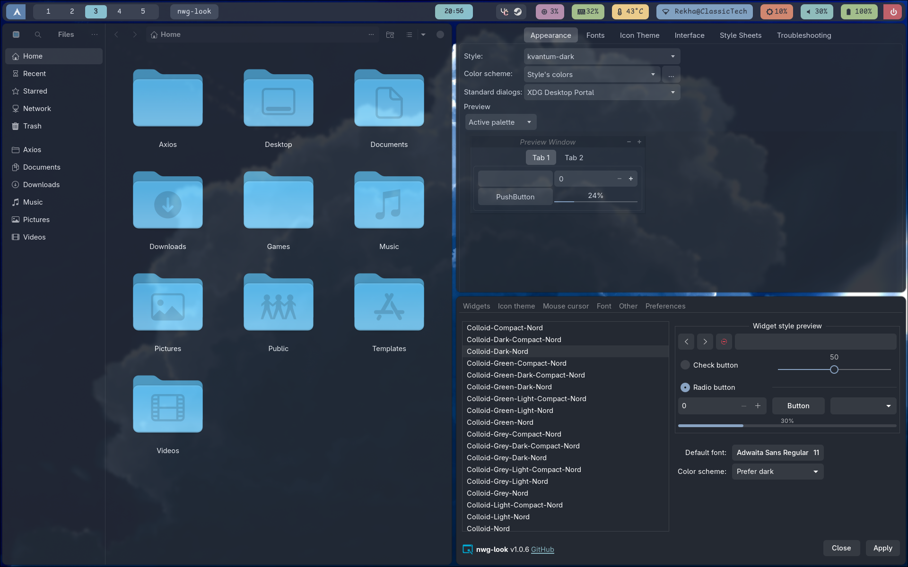
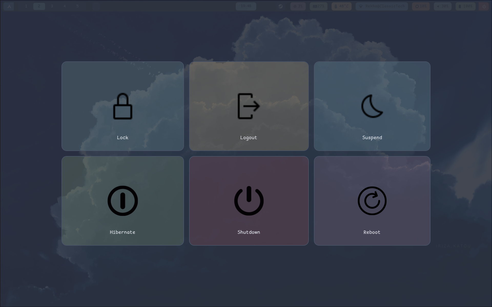

# Hypr-Nord Installation Guide

This guide outlines the steps to install and configure the Hypr-Nord environment using the provided `install.sh` script.

## Prerequisites

Before running the script, ensure you have:
*   An Arch Linux-based distribution.
*   Sudo privileges.
*   An active internet connection.

**Important Note for Minimal Arch Installations:**
If you are running this script on a minimal Arch Linux installation, ensure that `systemd` is configured to boot into a graphical target and that a suitable display manager is installed and enabled. Otherwise, your system may not boot into a graphical environment after installation.

Here are the commands to set up a display manager (e.g., SDDM or GDM):

1.  **Install a Display Manager (choose one, e.g., SDDM):**
    ```bash
    sudo pacman -S sddm
    # Or for GDM:
    # sudo pacman -S gdm
    ```

2.  **Enable the Display Manager service:**
    ```bash
    sudo systemctl enable sddm
    # Or for GDM:
    # sudo systemctl enable gdm
    ```

3.  **Set systemd to boot into graphical target (if not already):**
    ```bash
    sudo systemctl set-default graphical.target
    ```

## Installation Steps

Follow these steps to set up your Hypr-Nord environment:

### 1. Make the Installation Script Executable

First, navigate to the directory containing the `install.sh` file in your terminal and make it executable:

```bash
chmod +x install.sh
```

### 2. Run the Installation Script

Execute the script. It will perform a series of automated tasks:

```bash
./install.sh
```

The script will perform the following actions:

*   **Internet Connectivity Check**: Verifies if you have an active internet connection. If not, it will exit.
*   **System Update**: Synchronizes package databases and updates your system using `sudo pacman -Syu`.
*   **Add Chaotic-AUR Repository**: Adds the Chaotic-AUR repository to your `pacman.conf` and imports its signing key.
*   **Install `yay`**: Installs the `yay` AUR helper if it's not already present on your system.
*   **Install Packages**: Installs all necessary packages listed in the `packages` file using `yay`. You can add any additional packages you need to this `packages` file. **Be warned: If any package installation fails, the script will stop immediately.**
*   **Copy Configuration Files**: Copies all files from the `Configs` directory to `~/.config/`.
*   **Copy Theme Files**: Copies all contents from the `Theme` directory to `~/.themes/`. If `~/.themes` does not exist, it will be created.
*   **Copy Icon Files**: Copies all contents from the `Icons` directory to `~/.icons/`. If `~/.icons` does not exist, it will be created.
*   **Copy Font Files**: Copies all contents from the `Fonts` directory to `~/.fonts/`. If `~/.fonts` does not exist, it will be created. After copying, it rebuilds the font cache.
*   **Copy Wallpapers**: Copies all contents from the `Wallpapers` directory to `~/Pictures/`. If `~/Pictures` does not exist, it will be created.
*   **Set Zsh as Default Shell**: Checks if `zsh` is installed. If not, it installs `zsh` and then sets it as your default shell. You will need to log out and log back in for this change to take effect.
*   **Copy `.zshrc`**: Copies the provided `.zshrc` file to your home directory (`~/.zshrc`).

### 3. Post-Installation

After the script completes, it is recommended to:

*   **Log out and log back in**: This ensures that the new default shell (zsh) and other environment changes take effect.
*   **Reboot (Optional but Recommended)**: A full system reboot can help ensure all changes, especially those related to themes, icons, and fonts, are fully applied.

If you encounter any issues during the installation, please review the error messages provided by the script.

## Final Desktop Appearance

Here are screenshots of what your desktop will look like after a successful installation:




